# Bike-Sharing Program in Des Moines: Stakeholder Analysis

## Purpose of Analysis:

The purpose of this analysis is to provide data and visualizations to our potential investors illustrating strong evidence that a bike-sharing program in Des Moines would be a profitable business endeavor. 

**Special Instructions for Our Potential Investors:** The visualizations in screenshots below can be accessed at the link below and will give you the ability to filter and investigate the data in greater detail. 

[link to dashboard](https://public.tableau.com/views/Mod14BikeshareChallenge-Tableau/NYCCitibikeStory?:language=en-US&publish=yes&:display_count=n&:origin=viz_share_link "link to dashboard")

## Results:

### Visualization 1: Bike Checkout Duration

**Description:** These line graph visualizations illustrate the number of trips by bike checkout duration for all Citibike users. It can be filtered by the duration (in hours). 

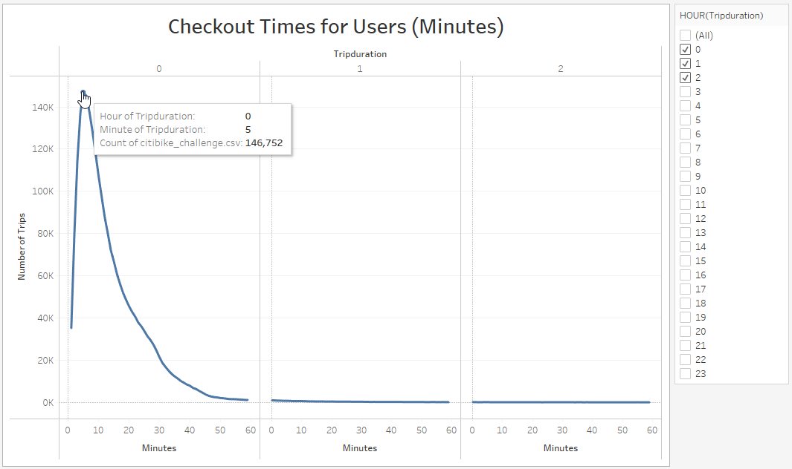

### Visualization 2: Bike Checkout Duration by Gender

**Description:** This visualization illustrates the number of trips by bike checkout duration (in hours) for each gender. It can be filtered by the duration (in hours) and gender. 

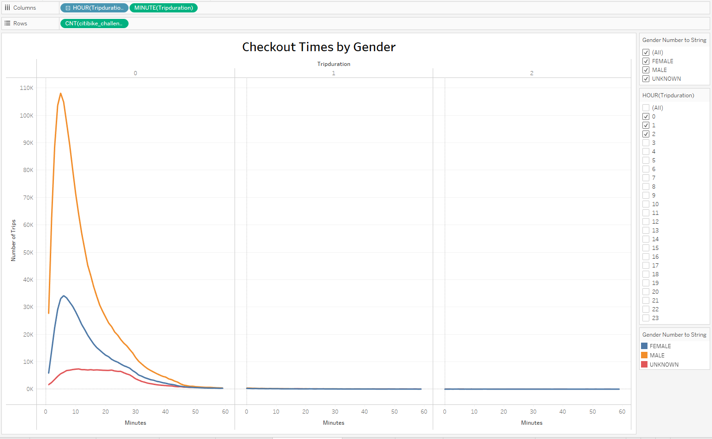

### Visualization 3: Number of Trips by Weekday

**Description:** This visualization displays a heatmap that shows the number of trips per hour for each day of the week. 

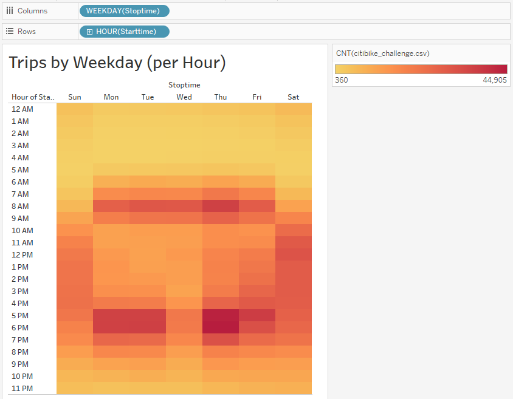

### Visualization 4: Number of Trips by Weekday and Gender

**Description:** This visualization displays a heatmap that shows the number of bike trips by gender and checkout duration (in hours) for each day of the week. The heatmap can be filtered by gender. 

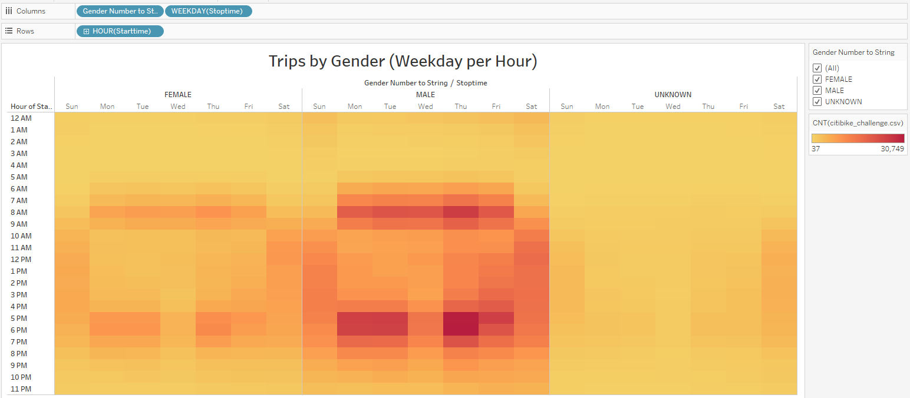

### Visualization 5: Number of Trips by User Type and Gender

**Description:** This visualization displays a heatmap showing the number of bike trips for each type of user and gender for each day of the week. It can be filtered by user type and gender. 

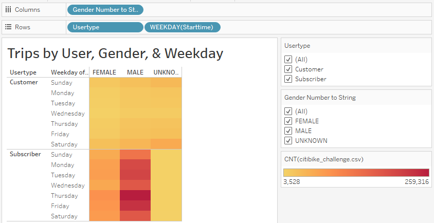

### Visualization 6: Gender Breakdown of All Users

**Description:** This visualization breaks down all users into gender-specific groups. 

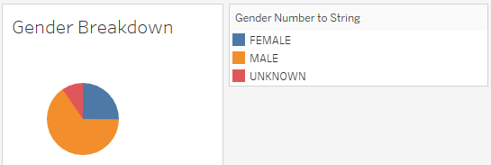

### Visualization 7: NYC August Peak Hours

**Description:** This visualization reflects Citibike peak hours in the month of August 

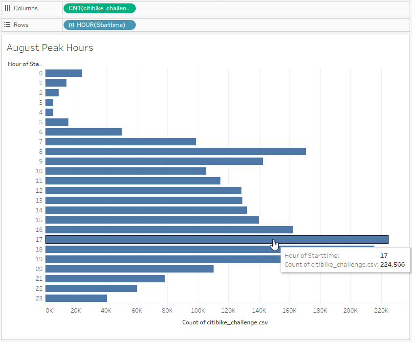

## Summary: Stakeholder Analysis

- **Visualization 1** reveals that a large majority of Citibike trips in New York City are less than 1 hour. 
  - Total # of Trips: 2,344,224
  - Number of Trips < 1 hour: 2,316,710 (98.8 % of all trips)
  - Number of 5-Minute Trips: 146,752 (6.3% of all trips)

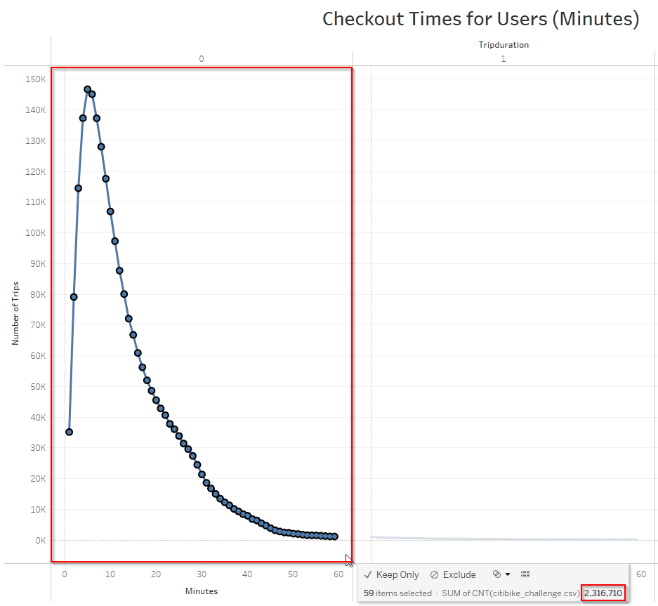

- **Visualization 2** reveals that 5 minutes is the most common checkout duration for males, while 6 minutes is the most common checkout duration for females. Therefore, Citibikes are often checked out for short distance trips to and from a specific location.  

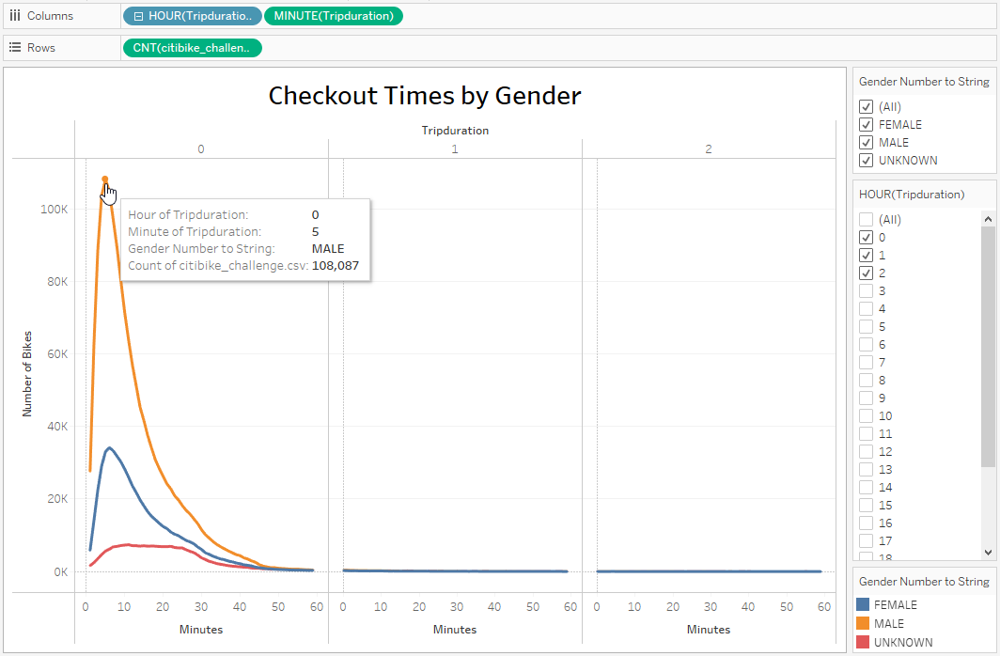

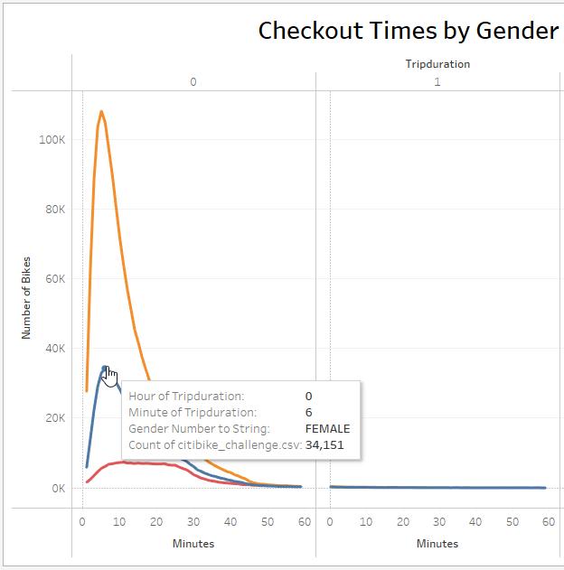

- **Visualization 3** shows that Thursday at 6 pm is the peak time for bike checkout. This may coincide with users renting a Citibike to travel home at the end of a work day. 

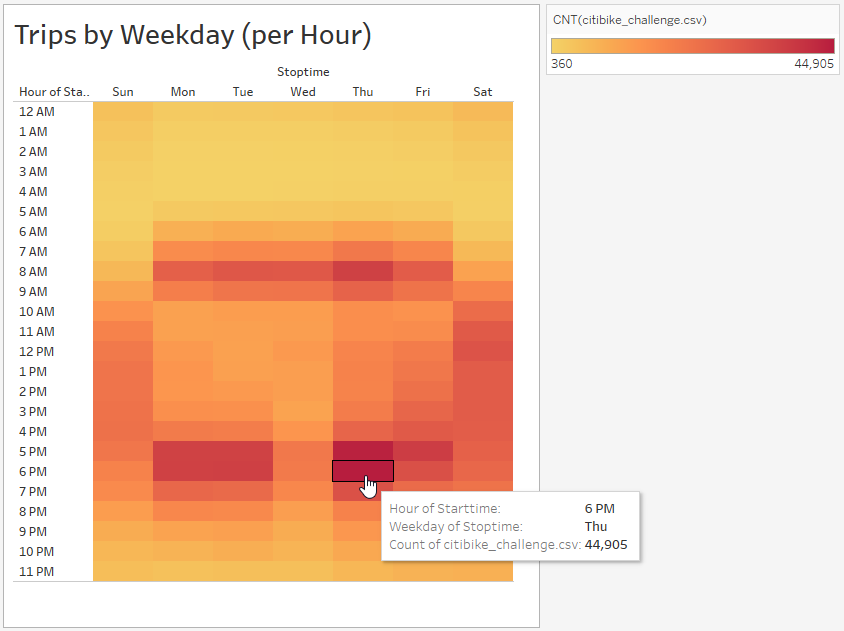

- **Visualization 4** is a variation of Visualization 3 that shows that Thursday at 6 pm is the peak time for bike checkout for both males and females.

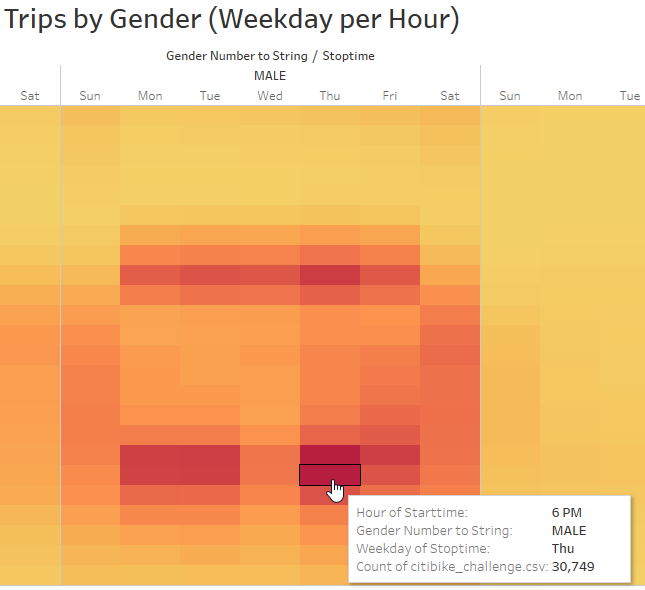

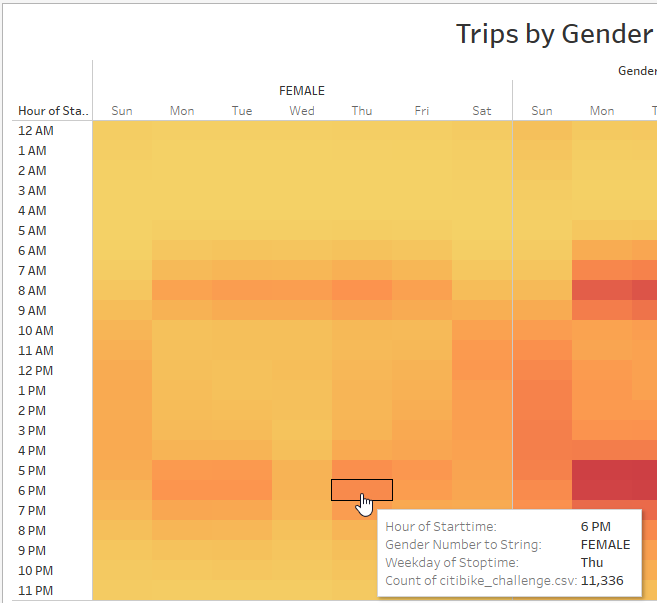

- **Visualization 5** is a variation on visuals 3 & 4 that illustrates that subscribers of both genders account for the most trips during the Thursday at 6 pm peak bikesharing hour.

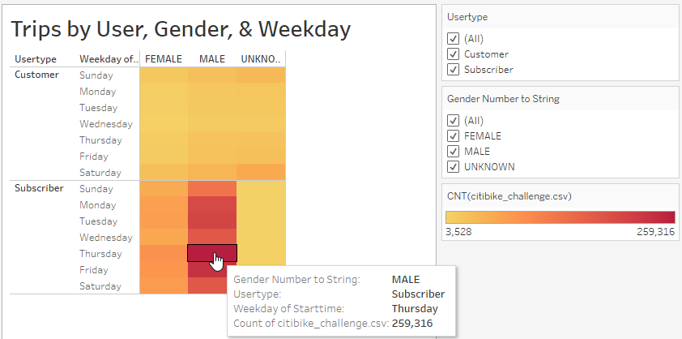

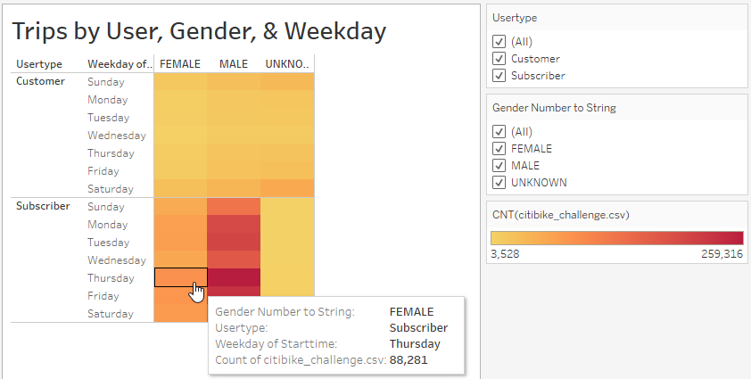

- **Visualization 6** illustrates the gender breakdown of Citibike users. 1,530,272 of all users are male, accounting for approximately 65% of all users. 588,431 of all users are female, accounting for approximately 25% of all users. 225,521 users are categorized as "Unknown" gender, accounting for approximately 10% of all users. This indicates that providing gender within the Citibike app is most likely not required for bike checkout to accommmodate for those who prefer not to share this information.

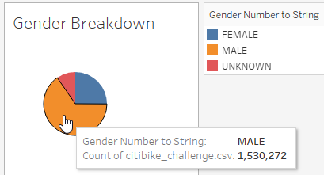

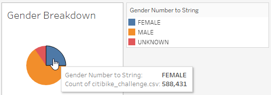

- **Visualization 7** illustrates the peak hour of bike checkout in the month of August in NYC. Checkout start time occurs most often at 5 pm. 

- **Two Additional Visualizations for Further Analysis:**

- One additional visualization that may provide helpful information would be a line graph illustrating the number of trips that can be filtered by user type, gender, and age. We've done a full analysis of usage by gender, but not as much by age. It would be helpful for stakeholders to gain a better understanding of the both the ages and genders of subscribers versus non-subscribers. This visualization has been provided below and indicates that subscribers are responsible for more trips, which is to be expected.  

**Number of Trips by User Type, Gender & Age**

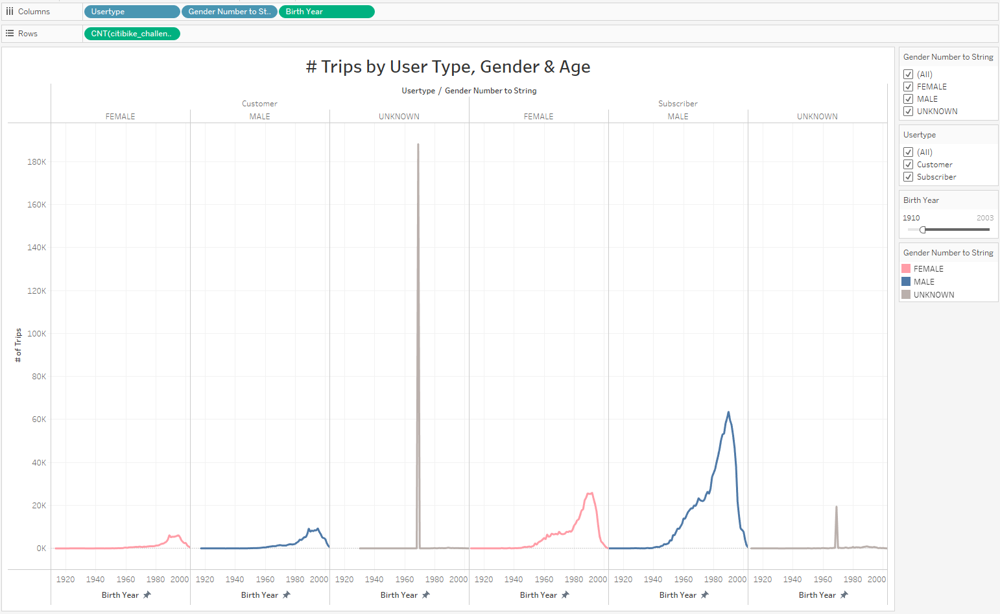

- An additional visualization that would be useful would be a line graph of birth date and user type to help gain an understanding the age distribution of subscribers so future marketing efforts could target these age groups as well as identify other age groups to target. 

